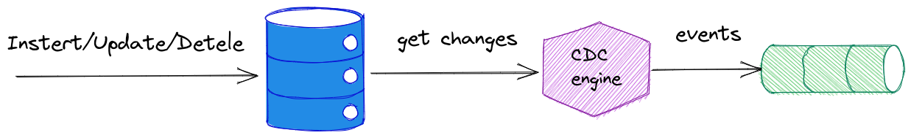

# Change Data Capture 
## (CDC)

---

## The worst bank ever
### v0.0.1 M1

Note:
* TBD
* TBD
* TBD

---

## Database model

---

---

## What we know so far

- dual writes is a problem
- Kafka does not support XA transactions
- `ChainedTransactionManager` is deprecated
- `TransactionalEventListener` is not a good option too...

Note:
*  two-phase commit protocol (2PC)
*

---

## Ok, so what now?
- avoid transactions? (CQRS, Saga, eventual consitency everywhere...)
- Change Data Capture

---

# Change Data Capture 

---

## Change Data Capture
### 101

---

## CDC Tools

- Debezium (Red Hat)
- Databus (LinkedIn)
- DBLog (Netflix)
- IBM Infosphere 
- Oracle GoldenGate
- Talend CDC
- DynamoDB*
- Bottled Water(unmaintained)

---

## MySQL

> The binary log contains "events" that describe database changes such as table creation operations or changes to table data...

[The Binary Log documentation](https://dev.mysql.com/doc/refman/8.0/en/binary-log.html)

---

## PostgreSQL
### Write-Ahead Logging (WAL)

> WAL's central concept is that changes to data files (where tables and indexes reside) must be written only after those changes have been logged, that is, after log records describing the changes have been flushed to permanent storage.

[Write-Ahead Logging (WAL) documentation](https://www.postgresql.org/docs/current/wal-intro.html)

---

## PostgreSQL
### Logical decoding

> Logical decoding is the process of extracting all persistent changes to a database's tables into a coherent, easy to understand format  ... In PostgreSQL, logical decoding is implemented by decoding the contents of the write-ahead log...

[Logical Decoding Concepts documentation](https://www.postgresql.org/docs/current/logicaldecoding-explanation.html)

---

## MongoDB 
### opLog 

---

## MongoDB 
### Change Streams 

 Change Streams

---

## What is common?

---

## What is common?
- transaction log file(s)
- API for streaming changes

---

## Debezium

[source](https://developers.redhat.com/articles/2021/06/14/application-modernization-patterns-apache-kafka-debezium-and-kubernetes#the_strangler_pattern)

---

## Kafka Connect

[source](https://howtoprogram.xyz/2016/07/10/apache-kafka-connect-example/)

---

## Debezium demo

---

## Debezium(CDC) - problems

---

## 