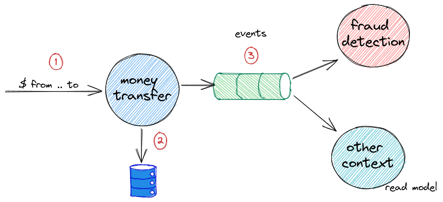

# Change Data Capture 
## (CDC)

---

## The worst bank ever
### v0.0.1 M1

Note:
* TBD
* TBD
* TBD

---

## Database model

---

---

## What we know so far

- dual writes is a problem
- Kafka does not support XA transactions
- `ChainedTransactionManager` is deprecated
- `TransactionalEventListener` is not a good option too...

Note:
*  two-phase commit protocol (2PC)
*

---

## Ok, so what now?
- avoid transactions? (CQRS, Saga, eventual consitency everywhere...)
- Change Data Capture

---

# Change Data Capture 

---

## Change Data Capture
### 101

---

## Change Data Capture
### 101

---

## Change Data Capture
### 101

---

## Change Data Capture
### How to

- triggers on a database
- queries on a database (with a `timestamp`)
- tracking changes in the transaction log

[here is a nice reading](https://datacater.io/blog/2021-09-02/postgresql-cdc-complete-guide.html)

---

## CDC Tools

- Debezium (Red Hat)
- Databus (LinkedIn)
- DBLog (Netflix)
- IBM Infosphere 
- Oracle GoldenGate
- Talend CDC
- DynamoDB*
- Bottled Water(unmaintained)
- CDC Connectors for Apache Flink

---

## MySQL
### binary log

> The binary log contains "events" that describe database changes such as table creation operations or changes to table data...

[Binary Log documentation](https://dev.mysql.com/doc/refman/8.0/en/binary-log.html)

---

## PostgreSQL
### Write-Ahead Logging (WAL)

> WAL's central concept is that changes to data files (where tables and indexes reside) must be written only after those changes have been logged, that is, after log records describing the changes have been flushed to permanent storage.

[Write-Ahead Logging (WAL) documentation](https://www.postgresql.org/docs/current/wal-intro.html)

---

## PostgreSQL
### Logical decoding

> Logical decoding is the process of extracting all persistent changes to a database's tables into a coherent, easy to understand format  

> In PostgreSQL, logical decoding is implemented by decoding the contents of the write-ahead log...

[Logical Decoding Concepts documentation](https://www.postgresql.org/docs/current/logicaldecoding-explanation.html)

---

## MongoDB 
### opLog 

> The oplog (operations log) is a special capped collection that keeps a rolling record of all operations that modify the data stored in your databases.

[Oplog documentation](https://www.mongodb.com/docs/manual/core/replica-set-oplog/)

---

## MongoDB 
### Change Streams 

> Change streams allow applications to access real-time data changes without the complexity and risk of tailing the oplog

[Change Streams documentation](https://www.mongodb.com/docs/manual/changeStreams/)

---

## What is common?

---

## What is common?
- transaction log file(s)
- "human-friendly" API for streaming changes

---

## Debezium

[source](https://developers.redhat.com/articles/2021/06/14/application-modernization-patterns-apache-kafka-debezium-and-kubernetes#the_strangler_pattern)

---

## Debezium

### Demo

---

## Debezium/CDC - findings

- reliable (no dual writes!)
- nice tool for integrastion with legacy systems
- can provide data for data lakes and data warehouses
- `before` and `after` states in events

---

## Debezium/CDC - findings

- "raw" CDC might not be good for business events:
  - events contain everything from tables
  - each table has its own topic/event
  - JOINs hard to re-create from events
  - you need to understand internals of the source service (db)
  - table schema change causes change of the event schema

---

## Debezium/CDC 
### how to fix JOINs and events

DEMO

---

# THANK YOU!
## Q&A