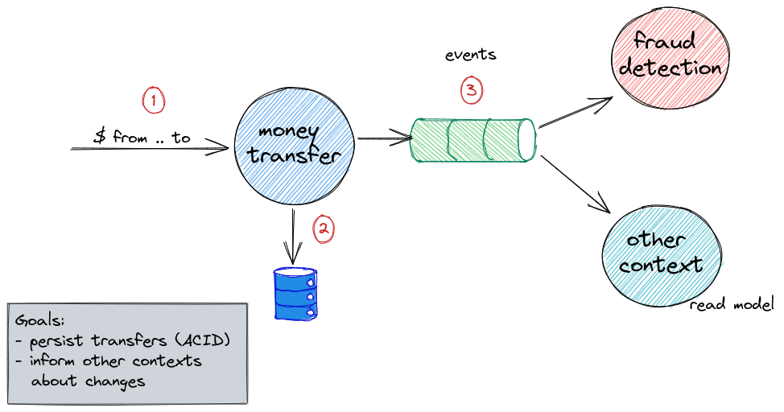

# Change Data Capture (CDC)

---

## The worst bank ever (v0.0.1 M1)

Note:
* TBD
* TBD
* TBD

---

## Database model

---

---

## What we know so far

- dual writes is a problem
- Kafka does not support XA transactions
- `ChainedTransactionManager` is deprecated
- `TransactionalEventListener` is not a good option too...

Note:
*  two-phase commit protocol (2PC)
*

## Ok, so what now?
- avoid transactions? (CQRS, Saga, eventual consitency everywhere...)
- Change Data Capture

---

## Change Data Capture (CDC)

---

## Change Data Capture (CDC) - 101

## CDC Tools

- Debezium
- Databus (LinkedIn)
- DBLog (Netflix)
- IBM Infosphere 
- Oracle GoldenGate
- Talend CDC
- DynamoDB
- Bottled Water(unmaintained)

## Debezium

## MySQL - binlog

## PostgreSQL - Write-Ahead Logging (WAL)

## MongoDB - opLog

## What is common?

### "Change Streams"
- solutions for data replication and streaming of changes
- PostgreSQL -> logical decoding (logical replication)
- MongoDB -> Change Streams

## Debezium demo

## Debezium(CDC) - problems